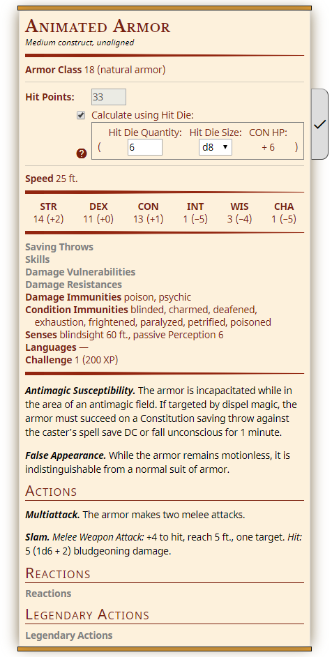
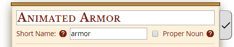
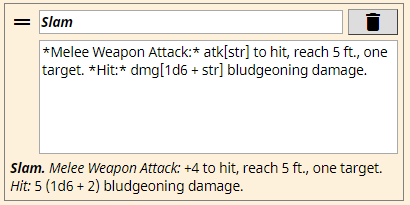
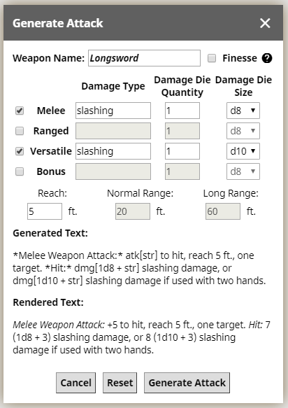

# Interactive Creature Statblock Creator for D&D 5th Edition

### Live Demo: [https://frumple.github.io/statblock5e-creator][demo]

A frontend web application for creating creature statblocks that are similar in appearance to the official blocks from the Dungeons and Dragons 5th Edition Monster Manual.

<div align="center">
  
</div>

## Features

- **One-column** or **Two-column** formats. Two-column statblock heights can also be adjusted manually.
- Hit points are automatically calculated from hit die and constitution, or enter your own custom hit points.
- Saving throws and skills are automatically calculated from ability modifiers and proficiency bonus, or enter your own custom modifiers.
- In the descriptions for Special Traits, Actions, Reactions, and Legendary Actions:
  - **[Markdown Emphasis](#markdown-emphasis)** to make text **bold** and/or *italic*.
  - **[Name Expressions](#name-expressions)** to inject the creature's name into the description where needed.
  - **[Math Expressions](#math-expressions)** to automatically calculate attack roll modifiers, average damage from damage rolls, and spell save DCs.
- **[Generate Attack Dialog](#generate-attack-dialog)** to easily create weapon attack actions.
- Export your statblock into a JSON file, and re-import it at a later time.
- Export your statblock into an HTML file, or a Markdown format for use in **[Homebrewery][homebrewery]**.
- Print your statblock to paper.

## Future Improvements

- Generate Spellcasting (currently disabled under Special Traits)
- Get suggested proficiency bonus from Challenge Rating
- Buttons to toggle bold/italic text and add expressions to Special Trait/Action/Reaction/Legendary Action descriptions
- Autofill common Special Traits and Actions
- Import monster stats from the [Open5e][open5e] API
- Export to [Improved Initiative][improved-initiative] (JSON format)
- Export as Image
- Offline/Local Storage
- Additional printing options, including printing 2 one-column statblocks side-by-side

## JSON Examples

Some example JSON files are available in the **[examples subdirectory][examples]**. Download these files to your local computer, then under the "Import" drop-down menu, click "Import from JSON" and select the file to import.

----------

## Markdown Emphasis

*Available only in descriptions for Special Traits, Actions, Reactions, and Legendary Actions, and in custom text for Armor Class, Speed, and Senses.*

You can surround text with asterisks and/or underscores to make it **bold** and/or *italic*:

| Formatting | Example | Result |
| ---------- | ------- | ------ |
| single asterisks         | `*Melee Weapon Attack:* +2 to hit`                       | *Melee Weapon Attack:* +2 to hit                       |
| single underscores       | `Cantrips (at will): _light, sacred flame, thaumaturgy_` | Cantrips (at will): _light, sacred flame, thaumaturgy_ |
| double asterisks         | `\**Type 1:\** Human body with snake head`               | **Type 1:** Human body with snake head                 |
| double underscores       | `\__Type 2:\__ Human head and body with snakes for arms` | __Type 2:__ Human head and body with snakes for arms   |
| asterisks in underscores | `Here are some __*asterisks* in underscores__`           | Here are some __*asterisks* in underscores__           |
| underscores in asterisks | `Here are some *__underscores__ in asterisks*`           | Here are some *__underscores__ in asterisks*           |

## Name Expressions

*Available only in descriptions for Special Traits, Actions, Reactions, and Legendary Actions.*

In the topmost section where you specify the creature's full name, you can also optionally specify a **short name**, and indicate whether the creature's name is a **proper noun**.

<div align="center">
  
</div>

### Short Name

The **short name** is typically one or two words used to refer to the creature in the descriptions of its special traits, actions, reactions, and legendary actions. In these descriptions, all instances of **`[name]`** are substituted with the short name when displayed. If the short name is blank, the creature's full name will be used instead.

Alternatively, you can use **`[fullname]`**, which is always replaced with the creature's full name. However, `[name]` should suffice for almost all use cases.

### Proper Noun

Check the **proper noun** box if the statblock describes a unique individual or creature.

If the proper noun box is **NOT** checked:
- The word "the" will precede all instances of `[name]` and `[fullname]`.
- The word "The" will begin with a capital letter if `[name]` or `[fullname]` is used at the beginning of a sentence.
- Any capitalization in the short name or full name will be removed.

##### Example

If the creature's short name is "**Mind Flayer**":

| Original Text | Displayed Text |
| ------------- | -------------- |
| `[name] has advantage...` | The mind flayer has advantage... |
| `...within 30 feet of [name].` | ...within 30 feet of the mind flayer. |

Otherwise, if the proper noun box **IS** checked:
- The word "the" will not appear.
- Capitalization of the short name and full name will be preserved.

### Usage Examples for Name Expressions

| Full Name | Short Name | Proper Noun? | Original Text and Displayed Text |
| --------- | ---------- | ------------ | -------------------------------- |
| Ancient Red Dragon | dragon | No | `[name] can take 3 legendary actions...`<br /><br />The dragon can take 3 legendary actions... |
| Gelatinous Cube | cube | No | `...a creature that does so is subjected to [name]'s Engulf...`<br /><br />...a creature that does so is subjected to the cube's Engulf... |
| Orc War Chief | orc<br /><br />OR<br /><br />war chief | No | `As a bonus action, [name] can move up to its speed...`<br /><br />As a bonus action, the orc can move up to its speed...<br /><br />As a bonus action, the war chief can move up to its speed... |
| Rust Monster | *(blank)* | No | `Nonmagical ammunition made of metal that hits [name] is destroyed after dealing damage.`<br /><br />Nonmagical ammunition made of metal that hits the rust monster is destroyed after dealing damage. |
| Casper the Friendly Ghost | Casper | Yes | `...the target is immune to [name]'s Horrifying Visage...`<br /><br />...the target is immune to Casper's Horrifying Visage... |
| Drizzt Do'urden | Drizzt | Yes | `...within 30 feet of [name].`<br /><br />...within 30 feet of Drizzt. |
| Lady Kima of Vord | Lady Kima | Yes | `[name] can invoke her Divine Smite...`<br /><br />Lady Kima can invoke her Divine Smite... |
| Tiamat | *(blank)* | Yes | `[name] can innately cast *divine ward*...`<br /><br />Tiamat can innately cast *divine ward*... |

Please note the use of name expressions is completely optional; you can certainly enter the creature's actual short/full names into the descriptions with no immediate issues. However, if you ever want to change the short/full name at a later time, or if you ever want to copy traits or actions into another statblock, then using name expressions will make these operations a lot easier than having to manually change every instance of the short/full name in the descriptions.

## Math Expressions

*Available only in descriptions for Special Traits, Actions, Reactions, and Legendary Actions.*

<div align="center">
  
</div>

Five different types of math expressions are supported. This table summarizes the usage of each:

| Type | Prefix | Usage | Example |
| ---- | ------ | ----- | ------- |
| Basic Math Expression | *(none)* | Add and subtract variables and integers | `[dex + prof + 1]`
| Modifier Expression | mod | Prepends "+" plus sign for resulting positive numbers | `mod[dex + prof + 1]`
| Attack Expression | atk | Calculates attack roll modifiers | `atk[dex]`
| Damage Expression | dmg |Calculates average damage for damage rolls | `dmg[1d10 + str]`
| Spell Save DC Expression | sdc | Calculates spell save DC | `sdc[wis]`

### Basic Math Expressions

Basic math expressions consist of a series of **operands** that can be added with **plus signs (+)** or subtracted with **minus signs (-)**, all within a pair of **square brackets []**.

Operands can be:
- **variables** (e.g. ability modifiers represented by `str`, `dex`, `int`, etc., and proficiency bonus represented by `prof`), or
- **integers** (e.g. 12, -3, or 0)

##### Example

If the creature's strength modifier is **+5** and its proficiency bonus is **+2**:
```
[str + prof - 3]
```
will be calculated as **5 + 2 - 3**, resulting in a final answer of **4**.

Note that whitespace between the operands and operators is optional, meaning that `[str+prof-3]` is a valid and equivalent math expression.

### Variables

Here are a list of variables that are currently supported in math expressions:

| Variable | Description | Note |
| -------- | ----------- | ---- |
| **`str`**  | Strength Modifier     |
| **`dex`**  | Dexterity Modifier    |
| **`con`**  | Constitution Modifier |
| **`int`**  | Intelligence Modifier |
| **`wis`**  | Wisdom Modifier       |
| **`cha`**  | Charisma Modifier     |
| **`fin`**  | Finesse Modifier      | For use in finesse weapons. Equal to strength or dexterity modifier, whichever is highest. |
| **`prof`** | Proficiency Bonus     |

### Modifier Expressions: mod[...]

One limitation of basic math expressions is that positive number results will appear without a positive sign (e.g. **5** instead of **+5**). The positive sign is needed to accurately show some modifiers, so to make it appear, simply add the prefix **`mod`** before the square brackets: **`mod[...]`**

##### Example

Assuming again that the creature's strength modifier is **+5** and its proficiency bonus is **+2**:
```
*Melee Weapon Attack:* mod[str + prof - 3] to hit
```
will appear as:

> _Melee Weapon Attack:_ +4 to hit

### Attack Expressions: atk[...]

Attack expressions are a useful shorthand for calculating attack roll modifiers. They begin with the prefix **`atk`** before the square brackets, and the **first operand must be the ability modifier (usually `str` or `dex`) on which the attack is based on.** Attack expressions will automatically add the proficiency bonus to the ability modifier without requiring the `prof` variable to be added to the expression. Subsequent operands can then added or subtracted from the first operand.

##### Example

Assuming again that the creature's strength modifier is **+5** and its proficiency bonus is **+2**:
```
*Melee Weapon Attack:* atk[str - 3] to hit
```
is effectively equivalent to the previous modifier expression example and will also appear as:

> _Melee Weapon Attack:_ +4 to hit

### Damage Expressions: dmg[...]

Damage expressions calculate the average damage for a given damage roll. They begin with the prefix **`dmg`** before the square brackets, and the **first operand must be a special dice operand (`d8`, `2d6`, etc.).** Subsequent operands can then be added or subtracted from the dice operand.

##### Example

If the creature's dexterity modifier is **+3**, then:
```
dmg[1d8 + dex + 2] slashing damage
```

will appear as:

> 9 (1d8 + 5) slashing damage

This is because since the average damage of 1d8 is 4.5 (rounded down to 4), then **4 + 3 + 2** equals **9** for the total average damage.

### Spell Save DC Expressions: sdc[...]

Spell save DC expressions are another useful shorthand. They begin with the prefix **`sdc`** before the square brackets, and the **first operand must be the creature's spellcasting ability modifier (usually `int`, `wis`, or `cha`).** These expressions calculate the spell save DC, which is equal to 8 + proficiency bonus + spellcasting ability modifier. Subsequent operands can then be added or subtracted from the first operand.

##### Example

If the creature's intelligence modifier is **+4** and its proficiency bonus is **+2**:
```
sdc[int]
```
will be calculated as **8 + 4 + 2**, totalling to a final result of **14**.

## Generate Attack Dialog

<div align="center">
  
</div>

In the **Actions** section, click **Generate Attack** to open this dialog. In the Weapon Name field, you can provide your own custom name, or you can select a predefined weapon, which will automatically populate the weapon details below. Previews will be shown for the attack action's generated text (using the appropriate markdown emphasis, and attack and damage expressions), and rendered text (how it will be displayed on the statblock). After you've made any changes, click Generate Attack to add the weapon attack action to the statblock.

----------

## Development Setup

Install all development dependencies with:

    npm install

### Tests

This application has an extensive suite of automated [Jest](jest) test cases that verify the behaviour of each section in the statblock.

Run all the tests with:

    npm test

## Dependencies

- [PEG.js][pegjs] - Parsing for Markdown emphasis, creature names, ability score modifiers, and mathematical expressions
- [DOMPurify][dompurify] - Sanitize inputted HTML tags
- [JSBeautify][jsbeautify] - Beautify HTML Export
- [Clipboard.js][clipboardjs] - Copy to clipboard functionality

## Credits

Statblock5e-creator is a fork of Valloric's awesome [statblock5e][statblock5e] template. It is also heavily inspired by [CritterDB][critterdb], another great tool for creating statblocks.

Some help popups in this application link to useful resources in [Open5e][open5e].

## Licensing

Statblock5e-creator is licensed under the [Apache License, Version 2.0][apache2].

All example monsters and stats used in this application are from the [Dungeons and Dragons Systems Reference Document (SRD) v5.1][srd], available through the Open Gaming License (OGL).

[demo]: https://frumple.github.io/statblock5e-creator
[examples]: https://github.com/Frumple/statblock5e-creator/tree/master/examples

[jest]: https://jestjs.io
[pegjs]: https://pegjs.org
[dompurify]: https://github.com/cure53/DOMPurify
[jsbeautify]: https://github.com/beautify-web/js-beautify
[clipboardjs]: https://clipboardjs.com

[statblock5e]: https://github.com/valloric/statblock5e
[critterdb]: https://critterdb.com
[homebrewery]: https://homebrewery.naturalcrit.com
[improved-initiative]: https://www.improved-initiative.com
[open5e]: https://open5e.com

[apache2]: http://www.apache.org/licenses/LICENSE-2.0.html
[srd]: https://media.wizards.com/2016/downloads/DND/SRD-OGL_V5.1.pdf